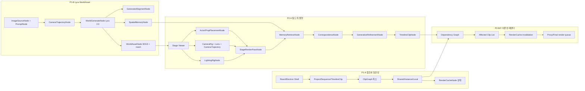

# SceneForge 구현 계획

기준 문서: [blueprint_sceneforge.md](blueprint_sceneforge.md), [node_graph_architecture.md](node_graph_architecture.md)  
코딩 규칙: [.cursor/rules/sceneforge-overview.mdc](.cursor/rules/sceneforge-overview.mdc), [.cursor/rules/sceneforge-node-graph.mdc](.cursor/rules/sceneforge-node-graph.mdc), [.cursor/rules/sceneforge-editor-ui.mdc](.cursor/rules/sceneforge-editor-ui.mdc)

목표는 복잡한 노드 편집기부터 만드는 것이 아니라, **Lyra 2.0 WorldAsset → 공유 참조 → 월드 위 촬영 → 영향 범위 표시 → 부분 재렌더링** 흐름을 먼저 동작시키는 것이다.

---

## 0. 문서 개요와 목표

### 한 줄 정의

SceneForge는 **타임라인 기반 제작 IDE** 위에서 Lyra 2.0이 만든 explorable world를 `WorldAsset`으로 받아오고, 그 월드·자산·룩·카메라 세팅을 여러 컷에서 공유하며, 변경된 노드와 연결된 컷만 다시 렌더링하는 시스템이다.

Lyra 2.0의 역할:

```text
image + camera trajectory
  -> long-horizon video
  -> SpatialMemoryCache
  -> 3DGS / surface mesh
```

SceneForge의 역할:

```text
WorldAsset
  -> Shared node references
  -> Shot production graph
  -> Timeline render cache
  -> Partial rerender
```

### 현재 구현 스냅샷 (`apps/editor`)

| 모듈 | 상태 | 비고 |
|------|------|------|
| React/Electron 셸 + 패널 (Timeline, Stage, Graph, Inspector, Library, Chat) | 부분 | World Generation 패널 **미착수** |
| `Project` / `Sequence` / `TimelineClip` / `ClipGraph` | 부분 | 스펙 필드 일부 갭 (아래 §3) |
| `NodeBase` / `NodeReference` | 부분 | 참조 타입 naming이 스펙과 다름 (`hard_link` vs `shared`) |
| `RenderCacheEntry` + 타임라인 cache UI | 부분 | status enum이 스펙과 다름 (`idle/ready/stale` vs `valid/invalid`) |
| `dependency.ts` / `invalidation.ts` | 부분 | 골격만, affected clips UX 미완 |
| `WorldAsset` + 샘플 월드 | 부분 | `public/worlds/apartment_livingroom/` |
| Stage 3D 뷰어 | 미착수 | placeholder UI |
| `core/lyra/` adapter | 미착수 | Lyra는 `dev/lyra` clone 완료, 클라우드 GPU inference 예정 |
| World Generation Graph 노드 타입 | 미착수 | blueprint §4.2 노드 카탈로그 대비 |
| GenerativeRefinement / StageRenderPass | 미착수 | |
| `editorStore.ts` 빌드 | 미완 | `.ts` 파일에 JSX — `.tsx` 변환 필요 |

**다음 작업:** [§5 P1-A](#p1-a-참조와-일관성)부터 순서대로 진행. Lyra 실연동은 P1-B.

---

## 1. 핵심 철학과 설계 원칙

1. **진입점은 timeline** — 노드 카탈로그나 script가 아니다. 타임라인, 스테이지 조작, 챗 의도 입력이 기본이다.
2. **그래프는 백엔드 구조** — 사용자가 노드를 직접 조립하는 화면이 아니다. 제작 상태·의존성을 설명한다.
3. **WorldAsset-first** — Lyra 결과를 `WorldAssetNode`로 패키징한다. 생성 모델 내부(DiT, token layout 등)는 노출하지 않는다.
4. **부분 재렌더링** — shared 노드 수정 시 affected clip list를 **먼저** 보여주고, 승인 후 proxy/final queue에 넣는다.

### 보여줄 것 / 숨길 것 (UI·Graph Editor 정책)

**보여줄 것**

- 컷이 공유 중인 월드·캐릭터·룩
- `Shared / Instance / Local` 상태
- 변경 시 영향받는 컷, memory coverage %
- proxy / final render cache 상태

**숨길 것**

- DiT 내부 구조, token layout, correspondence injection
- 내부 캐시 키, scheduler, low-level dependency hash

### 비기능 요구사항

- 진입점은 timeline이다.
- Lyra 2.0 adapter는 `core/lyra/`에서 분리해 교체 가능하게 둔다.
- 결과물보다 재현 가능한 recipe와 dependency graph가 1급 객체다.
- 모든 변경은 dependency graph로 추적 가능해야 한다.
- proxy/final cache는 분리하고, 변경된 downstream만 invalid 처리한다.

---

## 2. 세 가지 핵심 그래프

### 2.1 World Generation Graph

```text
ImageSourceNode
  ↓
CameraTrajectoryNode
  ↓
WorldGenerateNode(Lyra 2.0)
  ├─ output      → GeneratedSegmentNode(long-horizon video)
  ├─ update      → SpatialMemoryNode
  └─ reconstruct → WorldAssetNode(3DGS + mesh)
```

| 대응 패널 | MVP 단계 |
|-----------|----------|
| World Generation, Graph | P1-B |

### 2.2 Shot Production Graph

```text
WorldAssetNode
  ├─ SpatialMemoryNode
  ├─ WorldElementRefNode(camera_anchor)
  ├─ ActorPlacementNode
  ├─ PropPlacementNode
  ├─ CameraRigNode + LensNode + CameraTrajectoryNode
  └─ LightingRigNode
       ↓
StageRenderPassNode
       ↓
MemoryRetrieveNode
       ↓
GenerativeRefinementNode
       ↓
TimelineClipNode
```

| 대응 패널 | MVP 단계 |
|-----------|----------|
| Stage, Timeline, Graph | P2-A |

### 2.3 Dependency / Timeline Graph

```text
Shared WorldAssetNode
  ├─ used by → TimelineClipNode_001
  ├─ used by → TimelineClipNode_002
  └─ used by → TimelineClipNode_003

Shared LightingRigNode
  ├─ used by → TimelineClipNode_002
  └─ used by → TimelineClipNode_003

CameraTrajectoryNode changed
  ↓
GeneratedSegment invalid
  ↓
RenderCache invalid
  ↓
TimelineClip needs rerender
```

| 대응 패널 | MVP 단계 |
|-----------|----------|
| Timeline, Inspector, Library, Graph | P1-A, P2-B |

### 전체 의존 흐름 (구현 순서 보조)



---

## 3. 데이터 모델과 노드 카탈로그

### 3.1 Scope & Reference

| Scope | 용도 |
|-------|------|
| `project` | 월드, 캐릭터, 룩, 기본 카메라 |
| `sequence` | 조명, 무드, 세트 드레싱, 카메라 리그 |
| `clip` | 카메라 경로, 액션, 로컬 수정, 렌더 결과 |

| Reference | 의미 |
|-----------|------|
| `shared` | 여러 컷이 직접 공유. 수정 시 모두 영향 |
| `instance` | 원본 참조 + `override_patch` |
| `local` | 독립 노드 |

UI 배지는 `Shared / Instance / Local`로 통일한다.

### 3.2 핵심 타입 필드 (스펙)

| 타입 | 핵심 필드 |
|------|-----------|
| `TimelineClip` | `source_type`, `clipgraph_id`, `linked_world_id`, `camera_trajectory_node_id`, `render_cache_node_id`, `graph_snapshot_id`, `cache_status` |
| `NodeBase` | `scope`, `reference_type`, `version` |
| `NodeReference` | `override_patch`, `dependency_role`, `invalidates` |
| `WorldAsset` | `visual_layer_3dgs_path`, `surface_mesh_path`, `spatial_memory_node_id`, `production_overlay`, `versions` |
| `RenderCache` | `quality = proxy \| final`, `status = valid \| invalid \| rendering \| failed`, `dependency_hash` |

### 3.3 코드 ↔ 스펙 타입 갭

| 스펙 | 현재 코드 (`apps/editor`) | 조치 |
|------|---------------------------|------|
| `reference_type = shared \| instance \| local` | `hard_link \| instance \| copy` | P1-A에서 enum·라벨 정합 |
| `cache_status = valid \| invalid \| ...` | `idle \| ready \| stale \| ...` | P1-A에서 스펙 enum으로 통일 |
| `camera_trajectory_node_id` 등 clip 필드 | `proxyCacheId` / `finalCacheId` 위주 | P1-A에서 필드 보강 또는 매핑 레이어 |
| `WorldGenerateNode` 등 world graph 노드 | `WorldRefNode`, `CameraPathNode` 등 다른 naming | P1-B에서 blueprint 카탈로그로 정렬 |
| `core/dependency/` | `clipgraph/dependency.ts`만 존재 | P2-B에서 확장 |

### 3.4 노드 카탈로그 (MVP 최소 세트)

**Source** — `ImageSourceNode`, `PromptNode` (Video/AssetSource는 Future)

**World** — `WorldGenerateNode`, `GeneratedSegmentNode`, `WorldAssetNode`, `WorldElementRefNode`

**Memory** — `SpatialMemoryNode`, `MemoryRetrieveNode`, `CorrespondenceNode`

**Shot** — `CameraTrajectoryNode`, `CameraRigNode`, `LensNode`, `LightingRigNode`, `ActorPlacementNode`, `PropPlacementNode`, `ActionBlockNode`

**Render / Output** — `StageRenderPassNode`, `GenerativeRefinementNode`, `TimelineClipNode`, `RenderCacheNode`

---

## 4. 핵심 UX 플로우

### 4.1 월드 생성 → P1-B

1. 이미지 + 카메라 경로 입력
2. `ImageSourceNode`, `CameraTrajectoryNode` 생성
3. `WorldGenerateNode(Lyra 2.0)` 실행 (클라우드 GPU)
4. `GeneratedSegmentNode`, `SpatialMemoryNode` 저장
5. 3DGS / mesh를 `WorldAssetNode`에 패키징

### 4.2 월드에서 컷 촬영 → P2-A

1. Stage에서 배우·소품·카메라·조명 배치
2. `ActorPlacementNode` / `PropPlacementNode` / rig 노드 기록
3. `StageRenderPassNode` 생성
4. `MemoryRetrieveNode` → `GenerativeRefinementNode`
5. `TimelineClipNode` + `RenderCacheNode` 생성

### 4.3 공유 노드 수정 → 부분 재렌더 → P2-B, P2-C

1. shared 노드 수정
2. affected `TimelineClipNode` 목록 표시 (P2-B)
3. `RenderCacheNode` invalid (P2-C)
4. 사용자 승인 → proxy/final queue

### 4.4 패널별 체크리스트

**Timeline**

- [x] Add Empty Clip
- [ ] Import Video Clip (Future)
- [x] linked world 표시 (부분)
- [ ] `Shared / Instance / Local` 배지 통일
- [x] proxy/final cache status (부분)
- [ ] rerender needed 상태

**World Generation** (패널 미착수)

- [ ] 이미지·prompt 입력
- [ ] camera trajectory drawing
- [ ] Lyra job status
- [ ] artifact path 표시
- [ ] memory coverage

**Stage**

- [ ] 3DGS / mesh preview
- [x] rig·preset 버튼 (스텁)
- [ ] placement gizmo → 노드 persist
- [ ] production overlay toggle

**Graph**

- [x] 현재 컷 서브그래프 (부분)
- [ ] World / Shot / Dependency 뷰 전환
- [x] Reveal References (버튼만)
- [ ] affected clips preview

**Inspector**

- [x] 파라미터 편집 (부분)
- [ ] Shared/Instance/Local 배지
- [ ] Break Link / Make Local / Override Value

**Library**

- [x] 라이브러리 노드 목록 (부분)
- [ ] shared/instance로 다른 컷 연결

**Chat**

- [x] 패널 셸
- [ ] 자연어 → 노드 작업 번역 스텁

---

## 5. MVP 구현 단계

### P1-A. 참조와 일관성

**목표:** timeline + clipgraph + shared node reference의 최소 동작.

**선행 조건:** 없음

**포함 범위:** `WorldAssetNode`, `SpatialMemoryNode`, `CameraTrajectoryNode`, `TimelineClipNode`, `RenderCacheNode`, `Shared / Instance / Local` 배지, proxy render cache 상태, 영향받는 컷 표시 **(최소 버전)**

**작업**

- [ ] `editorStore.ts` → `editorStore.tsx` 빌드 에러 수정
- [ ] `TimelineClip` 스펙 필드 보강 (`camera_trajectory_node_id`, `graph_snapshot_id`, `cache_status`)
- [ ] `ReferenceType`을 `shared | instance | local`로 정합
- [ ] `CacheStatus`를 `valid | invalid | rendering | failed`로 정합
- [ ] 타임라인·Inspector에 `Shared / Instance / Local` 배지 통일
- [ ] Empty Clip 추가/선택/삭제 시 clip별 ClipGraph 저장 검증
- [ ] World Generation 패널 껍데기 추가 (`panels/world-generation/`)
- [ ] 영향받는 컷 **읽기 전용** 표시 (P2-B 전 최소 버전)

**UI / 패널:** Timeline, Inspector, Graph, Library

**핵심 파일:**

- `apps/editor/src/core/project/types.ts`
- `apps/editor/src/core/references/types.ts`
- `apps/editor/src/core/cache/types.ts`
- `apps/editor/src/panels/timeline/TimelinePanel.tsx`
- `apps/editor/src/state/editorStore.tsx`

**산출물:** Empty Clip 추가, clip별 ClipGraph, Shared/Instance/Local 배지, cache status UI

**완료 기준:** 사용자가 타임라인에서 empty clip을 추가하고, 컷별 참조 배지와 proxy/final cache 상태를 확인할 수 있다.

---

### P1-B. Lyra WorldAsset 연결

**목표:** Lyra 2.0의 결과를 SceneForge 월드 에셋으로 패키징.

**선행 조건:** P1-A

**포함 범위:** `ImageSourceNode -> WorldGenerateNode -> WorldAssetNode`, `GeneratedSegmentNode` 저장, 3DGS/mesh/SpatialMemory path, memory coverage 표시

**작업**

- [ ] World Generation Graph 노드 타입 (`core/nodes/`)
- [ ] `core/lyra/` adapter interface + stub job
- [ ] `core/lyra/cloudAdapter.ts` — 클라우드 GPU job submit/poll (Lyra `dev/lyra`)
- [ ] WorldAsset artifact registry (`core/world/`)
- [ ] World Generation Panel: 이미지·prompt·trajectory·job status·coverage UI
- [ ] `ImageSourceNode -> CameraTrajectoryNode -> WorldGenerateNode -> WorldAssetNode` 경로 persist

**UI / 패널:** World Generation, Graph

**핵심 파일:**

- `apps/editor/src/core/lyra/types.ts`
- `apps/editor/src/core/lyra/stubAdapter.ts`
- `apps/editor/src/core/lyra/cloudAdapter.ts`
- `apps/editor/src/panels/world-generation/WorldGenerationPanel.tsx`

**산출물:** Lyra output artifact registry, 월드 생성 상태 UI, stub 또는 cloud job 1회 성공

**완료 기준:** 이미지와 trajectory를 넣고 world generate job을 제출·완료 후 `WorldAsset`이 project에 등록된다.

---

### P2-A. 월드 위 촬영

**목표:** 생성된 월드에서 실제 촬영하듯 컷 제작.

**선행 조건:** P1-B (또는 샘플 `WorldAsset`으로 병행 가능)

**포함 범위:** `ActorPlacementNode`, `PropPlacementNode`, `CameraRigNode`, `LensNode`, `LightingRigNode`, `StageRenderPassNode`, `GenerativeRefinementNode`, `TimelineClipNode`

**작업**

- [ ] Stage Three.js viewport — mesh/GLB preview (`previewPath`)
- [ ] `WorldElementRefNode` overlay (actor mark, light socket 등)
- [ ] placement·camera·light gizmo → 노드 persist
- [ ] Shot Production 노드 타입 확장
- [ ] `StageRenderPassNode` stub (pass 메타데이터 + artifact path)
- [ ] `GenerativeRefinementNode` connector stub
- [ ] `MemoryRetrieveNode` / `CorrespondenceNode` stub
- [ ] 촬영 결과 → `TimelineClipNode` + cache 연결

**UI / 패널:** Stage, Timeline, Graph

**핵심 파일:**

- `apps/editor/src/panels/stage/StagePanel.tsx`
- `apps/editor/src/panels/stage/StageViewport.tsx` (신규)
- `apps/editor/src/core/render/` (신규)

**산출물:** Stage 월드 표시, actor/prop/camera/light 조작 저장, refinement stub, 타임라인 컷 생성

**완료 기준:** 샘플 또는 생성 월드 위에서 배치·카메라 조작이 노드로 저장되고 타임라인 컷과 연결된다.

---

### P2-B. 영향 범위 표시

**목표:** 공유 노드 수정 시 어떤 컷이 영향을 받는지 사용자에게 먼저 보여준다.

**선행 조건:** P1-A (P2-A와 병행 가능)

> P1 스펙의 "영향받는 컷 표시" 최소 버전은 P1-A 말미. P2-B에서 Reveal References·상태 문장·승인 전 UX를 완성한다.

**포함 범위:** Reveal References, affected clip list, Shared/Instance/Local 편집, 상태 문장

**작업**

- [ ] `core/dependency/` — node→clip usage index
- [ ] clip→RenderCache dependency hash
- [ ] shared 노드 변경 → affected clip list 계산
- [ ] Inspector: Reveal References, Break Link, Make Local, Override Value
- [ ] Library: shared/instance로 다른 컷 연결
- [ ] Graph: Dependency 뷰, affected clips preview
- [ ] 상태 문장 UI ("조명 노드를 수정하면 3개 컷이 다시 렌더링됩니다.")

**UI / 패널:** Timeline, Inspector, Library, Graph

**핵심 파일:**

- `apps/editor/src/core/dependency/`
- `apps/editor/src/core/clipgraph/dependency.ts`
- `apps/editor/src/panels/inspector/InspectorPanel.tsx`

**산출물:** Reveal References, affected clips, 참조 편집, 영향 범위 상태 문장

**완료 기준:** shared 조명 노드 수정 시 영향받는 컷 목록과 다시 렌더될 범위가 표시된다.

---

### P2-C. 부분 재렌더링

**목표:** 변경된 노드와 연결된 컷만 proxy/final render queue에 넣는다.

**선행 조건:** P2-B

**포함 범위:** `RenderCacheNode` invalidation, affected clip list, proxy/final queue, rerender approval UI

**캐시 종류**

- proxy render cache
- final render cache
- per-clip cache
- optional per-node evaluation cache
- generated segment cache
- spatial memory cache
- stage render pass cache

**invalidation 규칙**

| 노드 변경 | invalid 대상 |
|-----------|-------------|
| `WorldAssetNode` | 해당 월드 참조 컷 stage + render cache |
| `SpatialMemoryNode` | retrieve result, coverage score |
| `CameraTrajectoryNode` | generated segment, stage pass, render cache (downstream) |
| `LightingRigNode` | 참조 컷 render cache |
| `GenerativeRefinementNode` | refinement/final render만 (구조 cache 유지) |

**렌더 우선순위:** 플레이헤드 주변 > visible range > affected clips > background queue

**작업**

- [ ] `core/cache/invalidation.ts` — 스펙 규칙 전체 반영
- [ ] proxy / final queue 분리 (`core/render/queue.ts`)
- [ ] 공유 노드 수정 후 승인 UX
- [ ] `failed` 상태 + 재시도
- [ ] 타임라인 rerender needed 표시

**UI / 패널:** Timeline, Inspector

**핵심 파일:**

- `apps/editor/src/core/cache/invalidation.ts`
- `apps/editor/src/core/render/queue.ts`

**산출물:** invalidation, approval UX, proxy/final queue, cache status 갱신

**완료 기준:** shared 노드 수정 → 승인 → affected clips만 proxy/final 재생성된다.

---

### Future

**목표:** 실제 영상 클립과 동적 재구성.

**작업**

- [ ] `VideoSourceNode` — reference video / plate / motion reference
- [ ] camera path estimation
- [ ] background reconstruction
- [ ] dynamic scene reconstruction (optional module)
- [ ] shot template: interview, dialogue, action, night cafe
- [ ] advanced graph editor mode (전체 노드 카탈로그)

---

## 6. 부록

### MVP 대응 요약

| blueprint MVP | 구현 단계 |
|---------------|-----------|
| P1 참조와 일관성 | P1-A (+ P2-B 최소 버전) |
| P1 Lyra 2.0 WorldAsset | P1-B |
| P2 월드 위 촬영 | P2-A |
| P2 부분 재렌더링 | P2-B + P2-C |
| Future | Future |

### 핵심 타입 목록

```ts
Project
Sequence
TimelineClip
ClipGraph
NodeBase
NodeReference
ImageSourceNode
PromptNode
CameraTrajectoryNode
WorldGenerateNode
GeneratedSegmentNode
SpatialMemoryNode
MemoryRetrieveNode
CorrespondenceNode
WorldAssetNode
WorldElementRefNode
ActorPlacementNode
PropPlacementNode
CameraRigNode
LensNode
LightingRigNode
StageRenderPassNode
GenerativeRefinementNode
TimelineClipNode
RenderCacheNode
```

### 디렉터리 구조

```text
apps/editor/src/
  app/
  panels/timeline/
  panels/world-generation/
  panels/stage/
  panels/graph/
  panels/inspector/
  panels/library/
  panels/chat/
  state/
  core/project/
  core/timeline/
  core/clipgraph/
  core/nodes/
  core/references/
  core/dependency/
  core/cache/
  core/world/
  core/lyra/
  core/render/
```

### 최종 목표 문장

**SceneForge는 타임라인 위에서 영상을 편집하지만, 실제로는 Lyra 2.0으로 생성한 월드와 그 위의 제작 그래프를 평가해 결과를 얻는 시스템이다.**

- Lyra 2.0은 explorable world를 만든다.
- SceneForge는 그 월드를 여러 컷에서 공유 가능한 `WorldAsset`으로 관리한다.
- 컷은 비디오 파일이 아니라 재렌더 가능한 그래프 상태다.
- 사용자는 무엇이 공유되는지 보고, 필요한 부분만 고친다.
- 바뀐 노드와 연결된 컷만 다시 렌더링된다.
