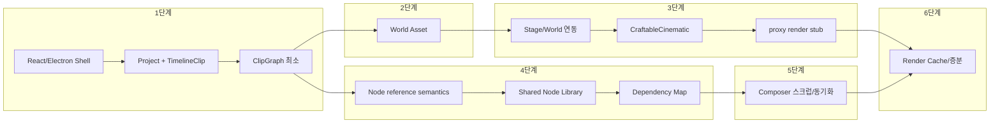

# SceneForge 구현 계획

본 계획은 [sceneforge_cursor_spec_updated.md](sceneforge_cursor_spec_updated.md) 696–706행의 **구현 순서 (의존 관계 기준 상세 10단계)**와 428–477행의 **6단계 우선순위**를 기준으로 한다. 현재 레포에는 에디터 코드가 없으므로 셸·데이터 모델부터 순차 구현한다.

---

## 의존 관계 다이어그램

---

## 1단계: 프로젝트 포맷 및 데이터 (상세 10단계 중 1–2)

**목표:** 프로젝트·타임라인·클립·ClipGraph 최소 모델과 3패널 에디터 셸이 동작하는 상태.

### 1.1 사전 정리

- 제품 요구사항·흐름 확정: 월드 → 샷 → 노드 → 렌더 → 캐시
- 성능 지표 정의: 수정 소요 시간, 재생성 횟수, 재사용률, 캐시 효율 (스펙 434행)

### 1.2 React/Electron 셸 및 레이아웃

- `apps/editor/` 하위에 React + Electron 앱 생성
- 3패널 레이아웃: **Timeline**, **Graph Editor**, **Inspector/Library** (스펙 435–436행)
- 스펙 666–684행 디렉터리 구조 준비:
  - `panels/timeline/`, `panels/graph/`, `panels/inspector/`, `panels/library/`, `panels/chat/`, `panels/stage/`
  - `state/`, `core/project/`, `core/clipgraph/`, `core/nodes/`, `core/references/`, `core/cache/`, `core/world/`

### 1.3 Project + TimelineClip 모델

- **Project**, **Sequence**, **TimelineClip** 타입 구현 (스펙 88–99행, 687–694행)
- TimelineClip 속성: `id`, `start`, `end`, `duration`, `source_type`(empty|video|generated), `linked_world_id`, `clipgraph_id`, `world_mode`, `proxy_cache`, `final_cache`
- 프로젝트 포맷(파일/폴더 구조) 정의 및 저장/로드

### 1.4 ClipGraph 최소 모델

- **ClipGraph** 1:1 클립 매핑: 클립 선택 시 해당 ClipGraph 로드/표시
- 빈 그래프 또는 **Source → Render 스텁**만 있어도 clip별 graph state가 저장·복원되도록 구현
- 클립 추가/선택/삭제 시 graph state 저장 연동

**산출물:** 빈 Composer 화면, Empty clip 추가, 클립별 ClipGraph 저장, 타임라인 기본 조작(추가/선택/삭제).

---

## 2단계: World Asset 파이프라인 (상세 10단계 중 3)

**목표:** 월드 에셋 생성·저장·로딩과 예제 로케이션 1종.

- **World Asset** 생성/저장/로드 기능 (스펙 62–86행: USD 기반, semantics.json, navmesh, preview 등)
- 예제 로케이션 1종 + 기본 소품 세트 구성
- `core/world/` 모듈 및 필요한 타입(`WorldAsset` 등) 정의

**산출물:** 수동 월드 로드 가능, 예제 월드로 파이프라인 검증.

---

## 3단계: Stage 연동 및 CraftableCinematic (상세 10단계 중 4–6)

**순서:** Stage 연동 → CraftableCinematic → proxy render stub (의존 관계상 Stage가 선행).

### 3.1 Stage/World 연동

- **WorldRefNode**, `world_mode`, world proxy 타입 추가
- **Stage Viewer** 패널 연결: 선택 클립의 월드가 3D 뷰에 표시
- [sceneforge_node_graph_architecture.md](sceneforge_node_graph_architecture.md) Scene Layer의 WorldRefNode·월드 모드와 정합

### 3.2 CraftableCinematic

- 3D 뷰에서 카메라/블로킹/조명 조작 도구
- 조작 결과를 **Cinematic 노드**(CameraRigNode, LensNode, LightingRigNode 등)로 기록·저장
- 샷 프리셋 WS, MS, CU 기반 빠른 구성 (스펙 468행, 312행)

### 3.3 proxy render stub

- ClipGraph → 1차 출력 파이프라인(스텁)
- 타임라인 playback 시 proxy 기반 재생 가능하게 준비

**산출물:** Stage에 월드 표시, 카메라/조명 craft 및 Cinematic 노드 저장, proxy 스텁으로 ClipGraph 출력 연동.

---

## 4단계: Shared Node System 및 Dependency Map (상세 10단계 중 7–8, 9 일부)

**순서:** Node reference semantics → Shared Node Library + Inspector → Dependency Map (참조 의미가 라이브러리/Inspector에 필요).

### 4.1 Node reference semantics

- **Hard Link / Instance / Copy** 데이터 모델·저장 형식 정의 (스펙 117–121행, 455행)
- `NodeReference`, `reference_type` 필드 및 직렬화

### 4.2 Shared Node Library + Inspector

- project-level **Shared Node Library**: 룩, 렌즈, 라이트리그, 이미지, 머티리얼 (스펙 456행)
- **Inspector**: 선택 노드 파라미터 편집, linked/instanced/local 표시, break link, reveal references (스펙 357–361행)

### 4.3 Dependency Map

- 변경 영향 범위 추적 및 사용처 탐색
- 6단계 cache invalidation에서 사용할 추적 데이터 구조 설계

**산출물:** 노드 참조 타입 적용, 라이브러리에서 노드 재사용, Inspector 편집 및 참조 표시, 의존성 추적 데이터.

---

## 5단계: Composer(Time View) 및 스크럽 동기화 (상세 10단계 중 9)

- ClipGraph 출력을 시간축에 배치, **트림·전환·오디오 싱크** 지원
- **플레이헤드 스크럽**과 3D 상태 동기화
- **캐시 기반 프리뷰** 구현
- 편집 뷰 ↔ 노드 라이브러리·참조 맵 **양방향 하이라이트** (스펙 472–473행)

**산출물:** 타임라인 스크럽 시 해당 시점 그래프/3D 상태 반영, 캐시 프리뷰 및 하이라이트.

---

## 6단계: Render Cache 및 증분 파이프라인 (상세 10단계 중 10)

- **proxy / final 캐시** 구조 구축 (스펙 364–379행)
- **변경된 노드 downstream만 재렌더**하는 증분 파이프라인 (4단계 Dependency Map 기반 invalidation)
- 외부 모델 연동 커넥터 1종 + 예제 워크플로우
- **cache status UI**
- (선택) empty clip용 image-based/3DGS/structured 3D 선택 UI, real video용 reference/reconstruction/4DGS UI
- (선택) camera rig / lighting rig 템플릿

**산출물:** proxy/final 캐시, 증분 invalidation·재렌더, 커넥터·예제, 캐시 상태 UI.

---

## MVP 대응 요약

| 스펙 MVP | 본 계획 단계 |

|----------|--------------|

| MVP-1 (timeline + clipgraph + shared node reference) | 1단계 + 4단계(참조 의미·라이브러리·Inspector) |

| MVP-2 (world 연결, Stage Viewer, Camera/Light Rig) | 2단계 + 3단계 |

| MVP-3 (empty clip 다중 월드 모드) | 6단계 선택 항목으로 진입점만 준비 |

| MVP-4 (실제 영상 클립 참조) | 6단계 선택 항목 이후 별도 단계로 확장 |

---

## 핵심 타입·파일 참조

스펙 687–694행 타입: `Project`, `Sequence`, `TimelineClip`, `ClipGraph`, `NodeBase`, `AssetNode`, `OpNode`, `NodeReference`, `WorldAsset`, `GaussianWorldProxy`, `RenderCacheEntry`.

디렉터리 구조는 스펙 666–684행 `apps/editor/src/` 하위 `app/`, `panels/*`, `state/`, `core/*`를 따른다.

---

## 비기능 요구사항 (스펙 480–488행)

- 진입점은 timeline(script 아님).
- 월드 생성은 optional module.
- 그래프 편집은 clip-local 기본, cross-clip reference 용이.
- 결과물보다 재현 가능한 recipe가 1급 객체.
- 모든 변경은 dependency graph로 추적 가능.
- empty clip과 real video clip은 서로 다른 world generation policy.
- 4DGS는 실제 영상 클립에서 optional.

이 요구사항은 1단계 설계 시 반영하고, 3·6단계에서 월드/캐시 정책으로 구체화한다.